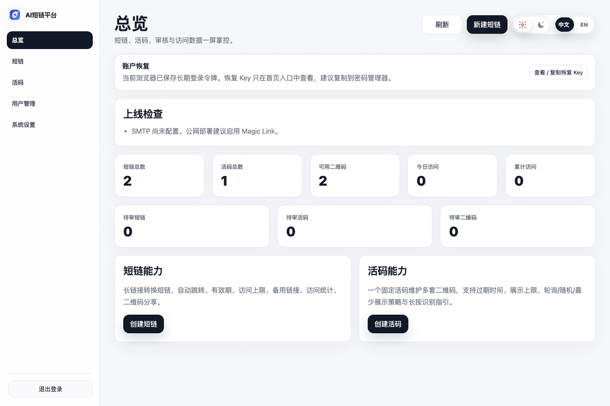

<p align="center">
  <a href="https://s.flyfish.dev">
    
  </a>
</p>

<h1 align="center">AI Shortlink</h1>

<p align="center">
  <strong>Keep every shared entry point controllable after it leaves your hands.</strong>
  <br>
  A self-hosted short link and live QR platform built for ownership, review, analytics, and responsible AI-assisted operations.
</p>

<p align="center">
  <a href="README.md">简体中文</a> · <a href="README.en.md">English</a>
</p>

<p align="center">
  <a href="https://github.com/flyfish-dev/shortlink/actions/workflows/ci.yml"></a>
  <a href="LICENSE"></a>
  
  
  <a href="https://s.flyfish.dev"></a>
</p>

<p align="center">
  <a href="https://s.flyfish.dev">Live product</a>
  · <a href="#why-ai-shortlink">Principles</a>
  · <a href="#capabilities">Capabilities</a>
  · <a href="#quick-start">Quick start</a>
  · <a href="ROADMAP.md">Roadmap</a>
  · <a href="CONTRIBUTING.md">Contributing</a>
</p>

## Product preview



The recording comes from a real instance and covers the dashboard, compact table actions, short links, live QR pools, branded QR customization, multi-format downloads, and system settings. The current production build is available at [s.flyfish.dev](https://s.flyfish.dev).

## Why AI Shortlink

Once a link or QR code is printed, published, or forwarded, it is difficult to take back. Its destination, permissions, and operating policy still need to evolve. AI Shortlink treats links and QR codes as durable digital entry points rather than one-time conversion artifacts.

- **Stable entry, evolving destination.** Keep the public address fixed while safely changing targets and distribution rules.
- **Control before automation.** Automated changes should be reviewable, confirmable, reversible, and auditable.
- **Explicit ownership.** Users manage only their own resources; administrators manage global settings and approvals.
- **Lightweight, not incomplete.** A single Go service with an embedded admin UI and SQLite by default, plus MySQL/MariaDB for larger deployments.

### What does “AI” mean?

[Issue #1](https://github.com/flyfish-dev/shortlink/issues/1) asked whether AI only means that the project was built with AI. It does not, and it also does not imply that every current feature is AI-powered.

The name captures two directions:

1. **Engineering practice:** human-led, AI-assisted development across design, implementation, testing, and documentation. Maintainers remain responsible for every decision.
2. **Product direction:** optional model integrations for configuration drafts, review context, risk signals, and operational insights.

The current release focuses on dependable link infrastructure. **It does not call an LLM by default and does not send link or user data to a third-party model provider.** Future AI features must be opt-in, data-minimal, human-confirmed, explainable, and auditable. See [ROADMAP.md](ROADMAP.md) for the staged plan.

## Capabilities

| Area | Included today |
| --- | --- |
| Short links | Custom codes, redirect types, schedules, visit limits, fallback URLs, QR codes, analytics |
| Live QR operations | Stable entry, multi-code pools, ordering, weights, rotation strategies, transactional saves |
| Branded QR codes | classic / rounded / dots, colors, center logo, live preview, SVG / PNG / WEBP export |
| Team workflow | Multi-user ownership, admin review, approval email, audit records |
| Authentication | Magic Link, GitHub OAuth, trusted-browser login, recovery key, account status controls |
| Analytics | 30-day trends, unique IPs, device/browser breakdowns, display and long-press intent events |
| Deployment | Docker, Linux amd64 binary, Render, SQLite, MySQL / MariaDB |
| Internationalization | Chinese and English product names, UI, and transactional email copy |

## Quick start

Docker with embedded SQLite is the smallest deployment:

```bash
git clone https://github.com/flyfish-dev/shortlink.git
cd shortlink
cp .env.example .env
docker compose up -d --build
```

Open `http://localhost:8080/setup` and complete the setup wizard. Runtime data is stored in a Docker volume.

For local builds, install Go 1.23+, a C compiler, and SQLite3 development headers:

```bash
make test
make build
./bin/ai-shortlink
```

See the [deployment guide](docs/DEPLOYMENT.md) for MySQL/MariaDB, GitHub OAuth, SMTP, HTTPS reverse proxying, systemd, and Render.

## AI evolution

| Stage | Goal | Status |
| --- | --- | --- |
| Trusted entry foundation | Links, live QR, ownership, review, analytics, authentication, deployment | Delivered; hardening continues |
| AI integration foundation | Optional providers, explicit data scope, prompt versions, invocation audit, graceful fallback | Planned |
| Configuration assistant | Turn natural-language intent into a reviewable configuration draft | Planned |
| Review assistant | Summarize destination context and risk signals without replacing admin judgment | Planned |
| Operational insights | Explain trends, flag anomalies, and propose traceable optimizations | Exploring |

The roadmap is not a release-date commitment. Features should begin as discussable Issues before implementation. Share real use cases through a [Feature request](https://github.com/flyfish-dev/shortlink/issues/new?template=feature_request.yml).

## Documentation

- [Deployment guide](docs/DEPLOYMENT.md)
- [Architecture](docs/ARCHITECTURE.md)
- [Users, ownership, and review](docs/USER_MANAGEMENT.md)
- [Roadmap](ROADMAP.md)
- [Contributing](CONTRIBUTING.md)
- [Security policy](SECURITY.md)
- [Support](SUPPORT.md)
- [Code of Conduct](CODE_OF_CONDUCT.md)

## License

AI Shortlink is licensed under [GNU Affero General Public License v3.0 only](LICENSE), SPDX `AGPL-3.0-only`. If you modify, distribute, or provide this project as a network service, follow the corresponding source-availability and notice requirements. See [NOTICE](NOTICE) for attribution details.

Copyright (C) 2026 [Flyfish Dev](https://flyfish.dev)
